# European Football Analysis (2008–2016)

An interactive data exploration of **25,979 football matches** across 11 European leagues over 8 seasons. All charts and data are precomputed into a single file — no server, no database, no API calls. Just open the page and explore.

**Live demo:** [.vercel.app]

---

## Sections

### Goal Distribution

Most matches are low-scoring (0–3 total goals). The most common scoreline is 1–1.

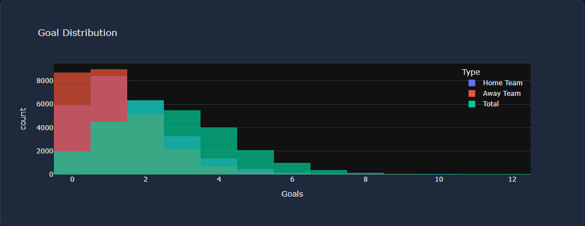

### Home Advantage

Home teams win 45.87% of matches, a consistent pattern across every league.

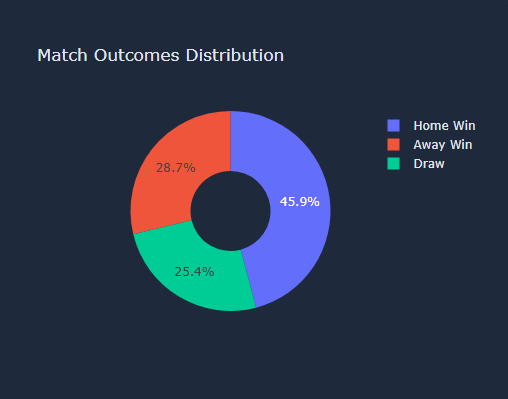
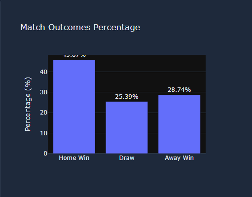

### Season Trends

Goal scoring and home advantage stayed remarkably stable from 2008 to 2016.

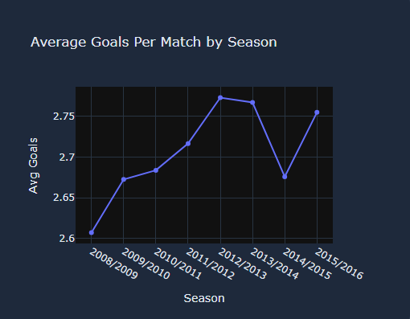
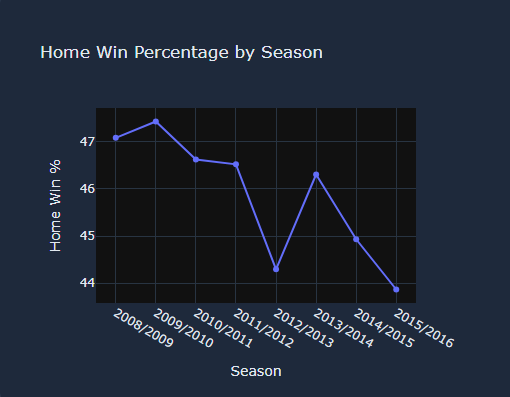

### League Comparison

The Netherlands Eredivisie leads with 3.08 goals per match. France Ligue 1 is the most defensive.

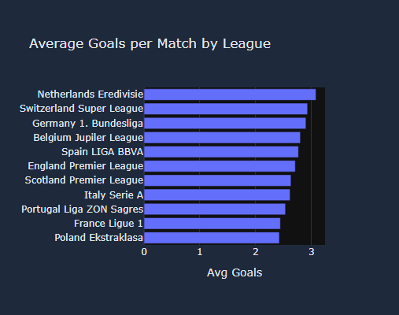
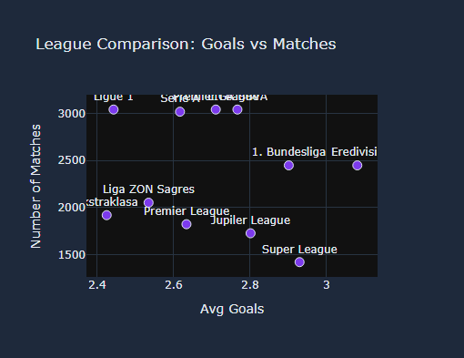

### Player Analysis

Top 20 players by goals and assists, parsed from XML event data across 14K matches. Messi (384 G+A) edges Ronaldo (355 G+A).

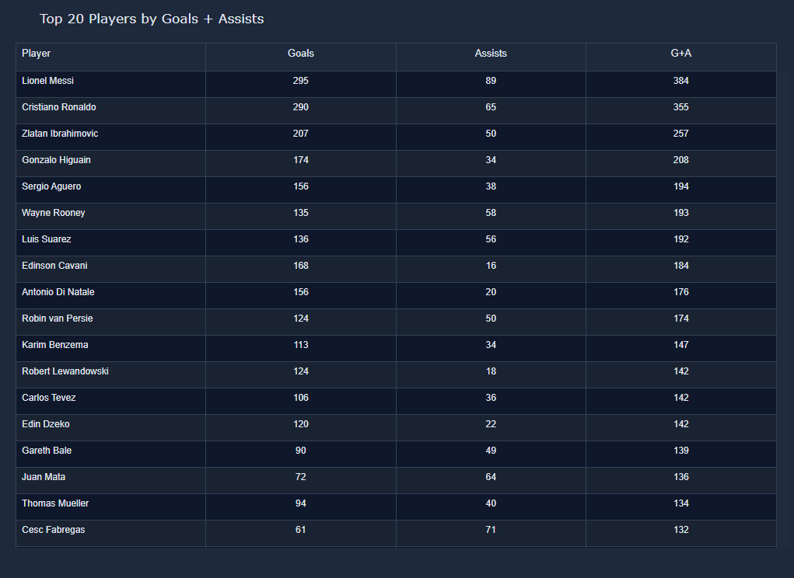
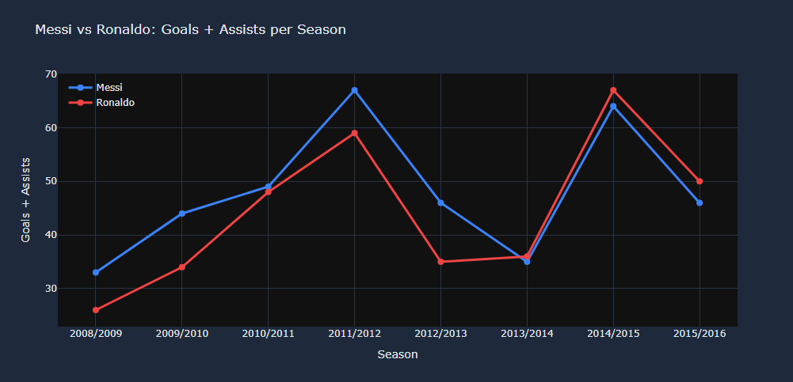

### Match Prediction Model

A Random Forest classifier using B365 betting odds achieves 55.2% accuracy. Home Win is easiest to predict (F1 = 0.68), Draw is hardest (F1 = 0.09).

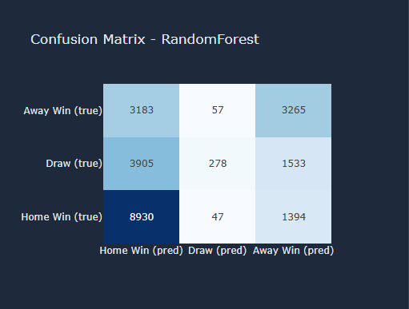
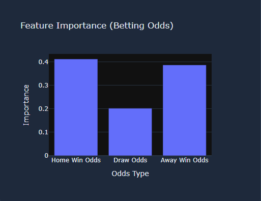
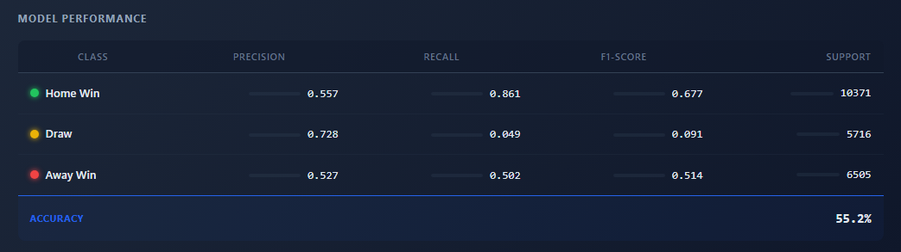

---

## How It Works (Step by Step)

This project has two parts:

1. **A Python script** that reads a database and produces a data file
2. **A web page** that reads that data file and displays charts

### 1. The Database

The raw data comes from the [European Soccer Database](https://huggingface.co/datasets/julien-c/kaggle-hugomathien-soccer) by Hugo Mathien. It is a single SQLite file (`.sqlite`) containing multiple tables:

- **Match** — every match: teams, score, date, season, betting odds
- **Player** — player names and IDs
- **Team** — team names and IDs
- **League** — league names
- **Country** — country names

SQLite is a file-based database — no server needed. Python can open it and run SQL queries directly.

### 2. `export_data.py` — The Pipeline

`export_data.py` is a Python script that:

1. Connects to the SQLite database
2. Runs SQL queries to extract match data
3. Computes statistics (win percentages, averages, etc.)
4. Generates interactive Plotly charts
5. Trains a machine learning model
6. Packages everything into a single JavaScript file called `data.js`

Here is the main query it runs:

```sql
SELECT M.id, M.season, M.date,
       C.name AS country, L.name AS league,
       M.home_team_goal, M.away_team_goal,
       M.B365H, M.B365D, M.B365A
FROM Match M
JOIN Country C ON M.country_id = C.id
JOIN League L ON M.league_id = L.id
```

This joins four tables to get: who played, when, the score, and the pre-match betting odds.

### 3. How the Charts Are Made

The script uses **Plotly**, a Python charting library. It creates each chart (histograms, pie charts, bar charts, scatter plots, tables) and converts every chart into a JSON object — a plain text description of the chart's data and layout.

These JSON chart objects get stored in a dictionary:

```python
charts["goal_distribution"] = fig_goal_dist.to_dict()
charts["home_advantage_pie"] = fig_home_adv_pie.to_dict()
# ... and so on for every chart
```

### 4. The Machine Learning Model

The script trains a **Random Forest classifier** — an algorithm that makes predictions by combining many decision trees:

```python
rf = RandomForestClassifier(n_estimators=200, max_depth=10, random_state=42)
rf.fit(X, y)
```

- **Input (features):** The three B365 betting odds (Home Win, Draw, Away Win)
- **Output (target):** The actual match result
- **Result:** 55.2% accuracy — betting odds encode match outcomes surprisingly well

The model outputs a confusion matrix (showing correct vs incorrect predictions) and a classification report (precision, recall, F1-score for each outcome).

### 5. `data.js` — The Bridge

The script dumps every statistic, every chart, and every model result into a single JavaScript file:

```python
js_content = f"window.SITE_DATA = {json.dumps(data, cls=PlotlyJSONEncoder)};"
```

This creates a global variable `window.SITE_DATA` that contains everything the web page needs. The file is about 198 KB — big enough to hold all the data, small enough to load instantly.

### 6. `index.html` — The Frontend

The web page is a single HTML file. It does three things:

1. Loads `data.js` (which sets `window.SITE_DATA`)
2. Loads Plotly.js from CDN (a free library for rendering charts)
3. Renders each chart by passing the precomputed JSON to Plotly

```javascript
const DATA = window.SITE_DATA;
const CHARTS = DATA.charts;
Plotly.newPlot("goalDist", CHARTS.goal_distribution.data, CHARTS.goal_distribution.layout);
```

No server, no database, no API. Everything runs in the browser.

---

## Project Structure

```
football-analysis-site/
  index.html         The web page (dark theme, Plotly charts)
  style.css          All colors, fonts, and layout
  data.js            Precomputed data (statistics + charts + model)
  export_data.py     Python script that generates data.js
  assets/            Screenshots for this README
  vercel.json        Configuration for deploying to Vercel
  README.md          This file
```

---

## Data Source

[European Soccer Database](https://huggingface.co/datasets/julien-c/kaggle-hugomathien-soccer) by Hugo Mathien, hosted on Hugging Face. Contains match results, player attributes, team info, and betting odds from 11 European leagues across 8 seasons (2008–2016).

The leagues included:

| Country | League |
|---------|--------|
| England | Premier League |
| Spain | La Liga |
| Germany | 1. Bundesliga |
| Italy | Serie A |
| France | Ligue 1 |
| Netherlands | Eredivisie |
| Portugal | Liga ZON Sagres |
| Scotland | Premier League |
| Belgium | Jupiler League |
| Switzerland | Super League |
| Poland | Ekstraklasa |

---

## How to Run Locally

The site works immediately — just open `index.html` in any browser. No installation needed.

### To Regenerate the Data (Optional)

If you want to re-run the data pipeline (for example, after fixing a bug or adding a new chart):

1. Download the database from the [link above](https://huggingface.co/datasets/julien-c/kaggle-hugomathien-soccer)
2. Place the `.sqlite` file in this folder and name it `database.sqlite`
3. Install Python dependencies:

```bash
pip install pandas numpy plotly scikit-learn
```

4. Run the pipeline:

```bash
python export_data.py
```

5. Refresh `index.html` in your browser

### Deploy to Vercel

```bash
npx vercel --prod
```

Vercel serves the folder as a static site. No build step required.

---

## Built With

- **Python** — data processing and machine learning
- **Pandas & NumPy** — data wrangling and statistics
- **Scikit-learn** — Random Forest classifier
- **Plotly** — interactive charts
- **SQLite** — database engine
- **Vanilla HTML, CSS, JavaScript** — frontend (no frameworks)
